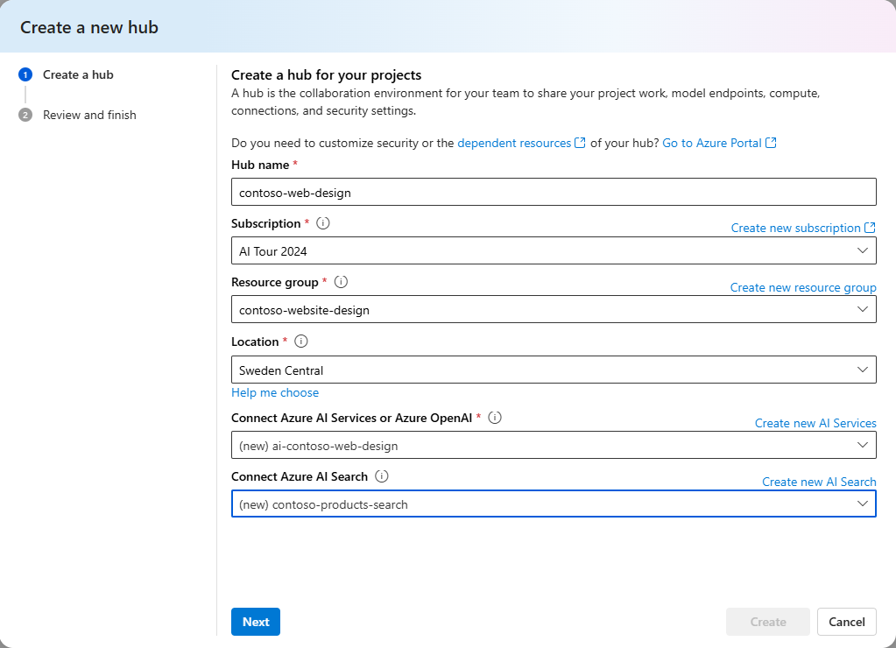
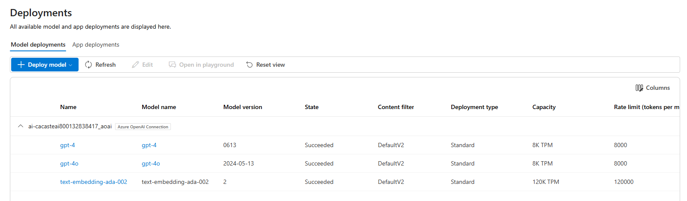
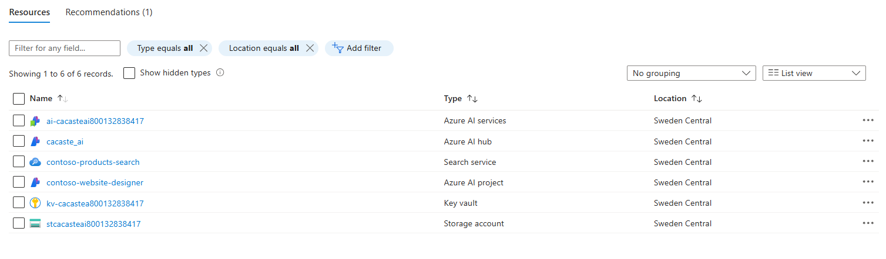

# Workshop Setup 


## Prerequistes: 

- You will need an Azure account. If you are an attendee of the Experts Live EU pre-day conf workshop, you'll be given an Azure pass along with the instructions to redeem the promo code.

>[!NOTE] Do not redeem promo code with an email account that is attached to an Enterprise Account or an email account you already used to redeem another Azure pass - it will not work. If needed, you can create a [new Microsoft account](https://signup.live.com/signup?sru=https%3a%2f%2flogin.live.com%2foauth20_authorize.srf%3flc%3d1033%26client_id%3d81feaced-5ddd-41e7-8bef-3e20a2689bb7%26mkt%3dEN-US%26opid%3d7C5DB83D1ABD4491%26opidt%3d1726652133%26uaid%3dd485e211148e4d7ca419bcf0bcb85b03%26contextid%3dBCC91F640A71C3DD%26opignore%3d1&mkt=EN-US&uiflavor=web&lw=1&fl=easi2&client_id=81feaced-5ddd-41e7-8bef-3e20a2689bb7&uaid=d485e211148e4d7ca419bcf0bcb85b03&suc=81feaced-5ddd-41e7-8bef-3e20a2689bb7&lic=1) to claim your benefit.

- You will need an IDE to build and test your first LLMs-based application. You can choose to run a [GitHub Codespace](https://github.com/features/codespaces) in the browser - **recommended option** - or work on your local [Visual Studio Code](https://code.visualstudio.com/) desktop app. You can click on the button below to open this repo in a GitHub Codespace.

 [](https://github.com/codespaces/new?hide_repo_select=true&machine=basicLinux32gb&repo=826281335&ref=main&devcontainer_path=.devcontainer%2Fdevcontainer.json&geo=UsEast)

 >[!NOTE] 
 > To use GitHub Codespaces, you need to have a GitHub Account. If you haven't one  already, please do [sign up for a free account](https://github.com/signup). 

## Option 1 - RECOMMENDED OPTION: Azure CLI Automation Script

*Warning:* An .env file with hard-coded values for local testing will be created in the src directory.
This file is used to store the environment variables for the project for demos and testing only.
Please do not share this file, or commit this file to the repository.
Delete this file when done with the workshop, or if you are not using it.

### Azure CLI Prerequisites

- [The Azure CLI must be installed](https://docs.microsoft.com/cli/azure/install-azure-cli?WT.mc_id=academic-145965-cacaste). **If you are in a GitHub Codespaces, you can use the included CLI, so no action required**. You should just open a new bash terminal and login to the Azure subscription where you want to provision the Azure AI resources. Use the following command to sign in:
```bash
az login --use-device-code
```

>[!NOTE]
>If you are not using the Azure CLI within a GitHub Codespaces environment, the extension for Azure Machine Learning must be installed.  See [https://docs.microsoft.com/azure/machine-learning/how-to-configure-cli](https://docs.microsoft.com/en-us/azure/machine-learning/how-to-configure-cli) for configuration instructions.
> To install the Azure Machine Learning extension, run: ```az extension add --name ml```

### Usage

### Run the Script

1. Navigate to the current directory:
   ```bash
   cd ./workshop-instructions
   ```

2. Make the script executable:
   ```bash
   chmod +x set_up.sh
   ```
3. Run the script:
   ```bash
   ./set_up.sh
   ```

## Option 2: Set up the demos using the Azure Portal and the Azure AI Studio UI

*Warning:* Use this option only if you have any blockers that prevent you to run the automation script.

Follow the steps below to set up the Azure AI Studio environment for this demo.

1. Navigate to [Azure AI Studio](ai.azure.com) and login with your Azure account. A hub provides a collaborative workspace to host your projects.
1. In the *Management* section, go to *All hubs* and then *Create a new hub*
1. In the configuration page, fill in the required fields. The recommended location for running this demo is **Sweden Central**, for the sake of models availability. Create a new Azure AI services to enable access to Azure OpenAI Service and an AI Search service to enable the search functionality.

1. Once the hub is created, navigate to *All projects* and click on *+ New Project* to create a new project. Make sure you select the hub you just created. 
1. In your newly created project, navigate to the *Deployments* page, under the *Components* section. Click on *+ Create deployment* to create a new deployment. For this demo you'll need 3 gpt instances: *gpt-4o*, *gpt-4* and *text-embedding-ada-002*. This is how your project's deployments section should look like:

At the end of this step, if you navigate to the [Azure Portal](portal.azure.com) your project resource group should look like this:

where the key vault and the storage account are created by default when you create a new Azure AI Studio hub.

