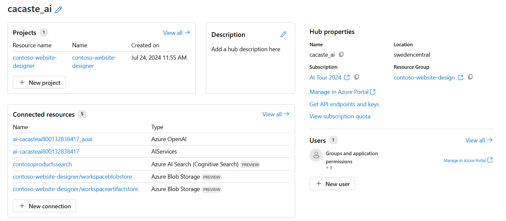
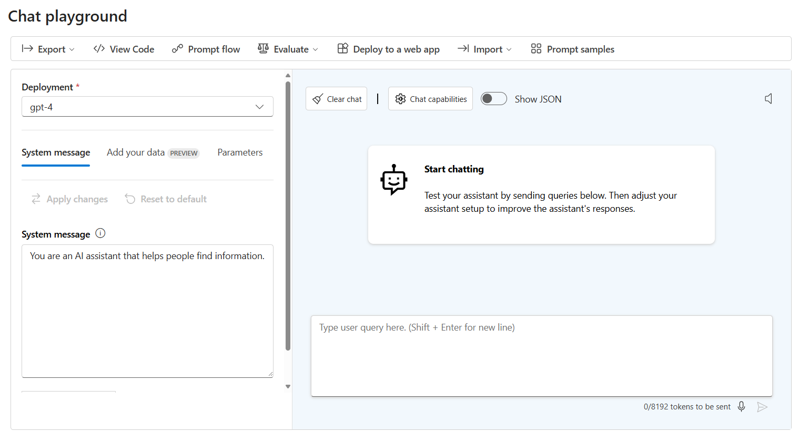

# Part 1 - Get Started with Azure AI Studio

The goal of this section is to get familiar with the main features of Azure AI Studio. Before starting, make sure you completed the [Setup](00_set_up.md) steps.

## Hub overview

First thing first, explore the hub you created in the setup phase, by navigating to [Azure AI Studio landing page](https://ai.azure.com). You can visualize the *Hub overview* by selecting *All resources* in the left-hand side menu and then clicking on your hub's name. Here you can see and manage the main components of the hub:

- **Projects**: A project is a resource within Azure AI Studio that grants you access to most of the platform's features, such as the **Playgrounds**. 
- **Description**: A short description of the Azure AI Studio Hub you are in.
- **Hub Properties**: A collection of various properties such as the Hub's name, its location, resource group, etc. Here you can find useful information such as *API endpoints and keys* and the *subscription's quota*.
- **Connected Resources**: Azure AI Studio allows for multiple resources to be connected to it, expanding its features and functionality. Resources such as Azure AI Search and Azure AI Service in this case further increase the capabilities of our Hub, and grant you access to deployments such as LLMs or functionalities such as vector search.
- **Permissions**: Allows you to grant access to collaborators or applications that may need to use the services within the Hub.

Next, click on the project you created in the setup phase, to get started with your Azure AI Studio tour.You will notice the navigation bar has updated with new tabs, which represent functionalities tied to your project. Go through each of them to get a better understanding of what you can do with Azure AI Studio.

## Get started

In the *Get Started* section, you can discover the capabilities of the pre-built models available in Azure AI Studio.

- The **Model Catalog** provides 1.7K+ open source and prioprietary models inside Azure AI Studio. You can filter models by provider, task, license or just type the model name in the search bar.

> [!TIP] 
> Search for one of the small language models from the *Phi-3* family, such as *Phi-3-mini*. Go through the model card to learn about training dataset, intended use cases and deployments options. Test it, by using the *Try it out* feature.
- **Model Benchmarks**: Here you can compare benchmarks across models and datasets available, with charts on accuracy, similarity, fluency, coherence, etc.
- **AI Services**: In the AI Services tab you can see a list of Azure AI Services available, along with demos, use cases and more.

## Project Playgrounds

The *Project Playgrounds* section is where you can interact with the gpt models you have deployed in the setup phase. Each option represents a different approach to interacting and using AI models, and each playground mode is designed for a specific use case. For example the **Images** playground is designed for image generation tasks, while the **Completions** playground is designed for text generation tasks.
In addition to that, the **Chat** playground allows you to create a quick prototype of a multimodal copilot, that you can customize, evaluate and deploy as a web app.
You are going to use this Playground in the following demo.

